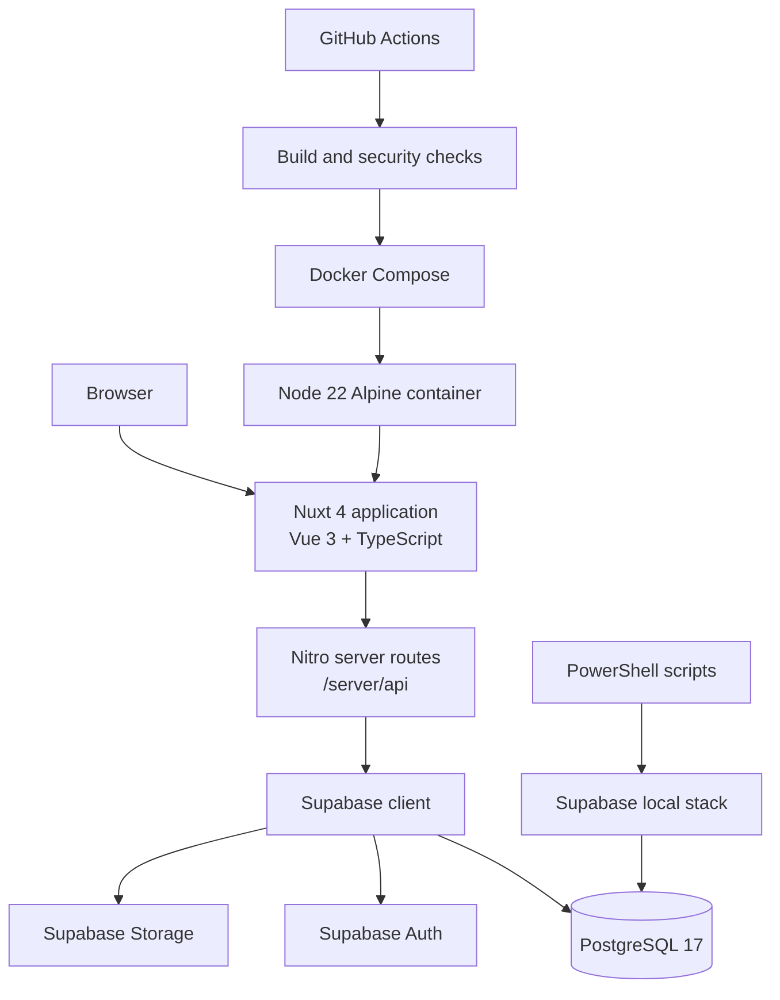
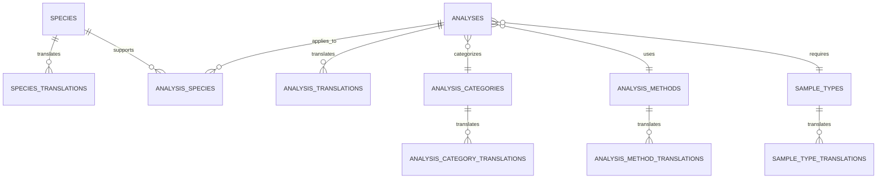
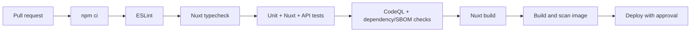

# Vetzet Technology Stack Blueprint

**Analysis mode:** Auto-detected, comprehensive, implementation-ready  
**Categorization:** Layer  
**Generated:** 2026-08-15  
**Repository scope:** `c:\Dev\My Projects\vetzet`

## 1. Executive Summary

Vetzet is a multilingual veterinary laboratory information portal. The active application is a Nuxt 4 server-rendered Vue 3 frontend with TypeScript, Nuxt UI, Tailwind CSS, and Nuxt i18n. Nitro server routes provide a small backend-for-frontend layer that queries a local or hosted Supabase project. Supabase supplies PostgreSQL, Auth, REST/PostgREST exposure, Realtime, Storage, and Studio during local development.

The repository also contains Docker packaging, PowerShell development scripts, GitHub Actions security workflows, and a minimal solution placeholder. No active .NET project file or Java/Python/React application was detected; `Vetzet.slnx` contains only a `src` folder entry.

### Confirmed primary stack

| Layer | Technology | Version / configuration | Role |
| --- | --- | --- | --- |
| Runtime | Node.js | 22 Alpine in Docker | Build and production runtime |
| Language | TypeScript | `^6.0.3` | Application, server, shared types, tests |
| Frontend framework | Vue | `^3.5.33` | Components and pages |
| Full-stack framework | Nuxt | `^4.4.4` | SSR, routing, Nitro server, build |
| UI | Nuxt UI | `^4.10.0` | Accessible component primitives |
| Styling | Tailwind CSS | `^4.3.3` | Utility styling |
| Routing | Vue Router | `^5.0.6` | Nuxt page routing and navigation |
| Localization | `@nuxtjs/i18n` | `^10.6.0` | Azerbaijani, English, Russian |
| Data platform | Supabase | Local CLI `^2.114.0`; Nuxt module `^2.0.9` | PostgreSQL, Auth, API, local services |
| Testing | Vitest | `^4.1.10` | Unit, Nuxt component/page, and E2E projects |
| Test DOM | happy-dom | `^20.11.1` | Nuxt test DOM environment |
| Container | Docker | Node 22 Alpine multi-stage image | Production packaging |

## 2. Repository and Deployment Topology



### Repository layers

```text
/
├── src/database/
│   ├── package.json                 Supabase CLI dependency
│   └── supabase/
│       ├── schemas/                 Ordered SQL schema sources
│       ├── seeds/                   Deterministic local data
│       ├── migrations/              Supabase migration snapshot
│       └── *.ps1                    Local database workflows
├── src/web-app/
│   ├── app/                        Nuxt pages, layouts, components, middleware
│   ├── server/api/                 Nitro HTTP endpoints
│   ├── shared/                     Database and domain types
│   ├── i18n/locales/               az, en, ru JSON messages
│   ├── test/                       unit, Nuxt, and E2E tests
│   ├── nuxt.config.ts              Framework and module configuration
│   └── package.json                Web application scripts and dependencies
├── docker-compose*.yaml            Container development/run configuration
└── .github/workflows/              CI, CodeQL, tfsec, and Scorecard
```

## 3. Technology Inventory

### 3.1 Application dependencies

The following direct versions are declared in `src/web-app/package.json`; `src/web-app/package-lock.json` uses lockfile version 3 and records resolved transitive versions and integrity hashes.

#### Runtime dependencies

| Package | Declared version | Purpose | License note |
| --- | ---: | --- | --- |
| `nuxt` | `^4.4.4` | Full-stack Vue framework | Verify package metadata before redistribution |
| `vue` | `^3.5.33` | Reactive UI runtime | MIT |
| `vue-router` | `^5.0.6` | Client routing | MIT |
| `@nuxt/ui` | `^4.10.0` | UI components | Verify current package metadata |
| `@nuxt/icon` | `^2.4.1` | Icon integration | Verify current package metadata |
| `@nuxt/image` | `^2.0.0` | Image optimization integration | Verify current package metadata |
| `@nuxt/scripts` | `^1.0.6` | Script integration | Verify current package metadata |
| `@nuxt/eslint` | `^1.15.2` | Nuxt ESLint integration | Verify current package metadata |
| `@nuxtjs/i18n` | `^10.6.0` | Localized routes and messages | Verify current package metadata |
| `@nuxtjs/supabase` | `^2.0.9` | Supabase composables and server client | Verify current package metadata |
| `tailwindcss` | `^4.3.3` | Utility-first styling | MIT |
| `typescript` | `^6.0.3` | Static typing and tooling | Apache-2.0 |
| `eslint` | `^10.3.0` | Linting | MIT |
| `buffer` | `^6.0.3` | Browser-compatible Buffer implementation | MIT |

#### Development and test dependencies

| Package | Declared version | Purpose |
| --- | ---: | --- |
| `vitest` | `^4.1.10` | Test runner |
| `@nuxt/test-utils` | `^4.0.3` | Nuxt test project integration |
| `@testing-library/vue` | `^8.1.0` | User-oriented Vue testing helpers |
| `@vue/test-utils` | `^2.4.11` | Vue component mounting |
| `vue-tsc` | `^3.3.9` | Vue-aware type checking |
| `happy-dom` | `^20.11.1` | DOM implementation for tests |
| `@types/node` | `^26.2.0` | Node.js declarations |
| `@iconify-json/lucide` | `^1.2.121` | Lucide icon data |
| `@iconify-json/mdi` | `^1.2.3` | Material Design Icons data |
| `@iconify-json/uil` | `^1.2.3` | Uil icon data |

The database workspace declares `supabase` `^2.114.0` as a development dependency. Direct package license data is partially visible in the npm lockfile; use `npm ls --json` or package metadata when a complete SBOM or redistribution review is required.

### 3.2 Configuration and build tooling

- `nuxt.config.ts` enables Nuxt UI, Icon, Image, Scripts, ESLint, i18n, Supabase, and Nuxt test utilities.
- `typescript.typeCheck` is disabled during Nuxt startup; type checking is an explicit `npm run typecheck` step.
- `package-lock.json` is committed and should be installed with `npm ci` in reproducible CI environments.
- `Dockerfile` builds with Node 22 Alpine, runs `npm install`, executes `npm run build`, then copies only `.output` into a smaller runtime image.
- `docker-compose.yaml` exposes the web application on port 3000 and loads `src/web-app/.env`.
- `eslint.config.mjs` extends the generated Nuxt ESLint configuration.

## 4. Frontend Implementation Patterns

### Application shell

`app/app.vue` wraps the site in `UApp`, `NuxtLayout`, `NuxtPage`, `NuxtErrorBoundary`, `NuxtRouteAnnouncer`, and `NuxtLoadingIndicator`. Global SEO metadata is configured with `useSeoMeta`. Layout selection is convention-based, with `/admin/**` mapped to the `admin` layout through `routeRules`.

### Page pattern

Pages use `<script setup lang="ts">`, Nuxt composables, and localized metadata:

```vue
<script setup lang="ts">
const { t, locale } = useI18n()
const route = useRoute()
const router = useRouter()

useHead({ title: t('pages.analyses.title') })
useSeoMeta({
  title: t('pages.analyses.title'),
  description: t('pages.analyses.description'),
})

const { data, status, error } = await useLazyFetch<Analysis[]>('/api/analyses', {
  headers: { 'accept-language': locale },
  query: { q: route.query.q },
  lazy: true,
})
</script>
```

Use `useLazyFetch` for page data that should not block initial rendering. Represent pending, error, empty, and success states explicitly. Keep URL-backed filters in `route.query` so filtering is linkable and browser navigation remains meaningful.

### Component pattern

Components receive typed props and compose Nuxt UI primitives. Repeated catalog rows belong in focused components such as `AnalysisList.vue`, while page components own fetching, query state, and page-level SEO.

```vue
<script setup lang="ts">
defineProps<{
  analyses: Analysis[]
}>()
</script>

<template>
  <div class="grid md:grid-cols-2 xl:grid-cols-3 gap-4">
    <NuxtLink
      v-for="analysis in analyses"
      :key="analysis.id"
      :to="$localePath({ name: 'analyses-slug', params: { slug: analysis.slug } })"
    >
      <UCard>
        <h3>{{ analysis.name ?? analysis.slug }}</h3>
      </UCard>
    </NuxtLink>
  </div>
</template>
```

### Internationalization

- Supported locale codes are `az`, `en`, and `ru`.
- Azerbaijani is the default locale.
- `prefix_except_default` gives the default locale unprefixed routes and prefixes non-default locales.
- Browser-language detection is disabled.
- Translated UI messages are stored in `i18n/locales/*.json`.
- Data requests forward the active locale through `Accept-Language` so server routes can select translated rows.

### Styling and icons

Tailwind utility classes are used directly in templates. Nuxt UI supplies components such as `UPageSection`, `UInput`, `USelect`, `UAlert`, `UCard`, and `UBadge`. Icons use Iconify names such as `i-lucide-search`; server bundles include `uil` and `mdi`, while client scanning is enabled.

## 5. Server and API Patterns

Nitro automatically maps files under `server/api` to HTTP routes. Current examples include:

| File | Method and route | Responsibility |
| --- | --- | --- |
| `server/api/analyses/index.get.ts` | `GET /api/analyses` | Active analyses with category, species, and text filters |
| `server/api/analyses/[slug].get.ts` | `GET /api/analyses/:slug` | Analysis detail lookup |
| `server/api/species/index.get.ts` | `GET /api/species` | Species catalogue |
| `server/api/analysis-categories/index.get.ts` | `GET /api/analysis-categories` | Category catalogue |
| `server/api/contact.post.ts` | `POST /api/contact` | Contact payload validation and temporary logging |

### Typed Supabase query pattern

```ts
import { serverSupabaseClient } from '#supabase/server'
import type { Database } from '#shared/types/database.types'

export default defineEventHandler(async (event) => {
  const query = getQuery<{ category?: string; species?: string; q?: string }>(event)
  const language = tryHeaderLocale(event)?.toString()
  const client = await serverSupabaseClient<Database>(event)

  let request = client
    .from('analyses')
    .select('id,slug,price,currency,translations:analysis_translations(language,name)')
    .eq('is_active', true)

  if (query.category) {
    request = request.eq('category_id', String(query.category))
  }

  const { data, error } = await request
  if (error) {
    console.error('Error fetching analyses:', error)
    throw createError({ statusCode: 500, message: error.message })
  }

  return data
})
```

### API boundaries and requirements

- Parse query parameters with `getQuery` and normalize external values with `String`.
- Use generated `Database` types for Supabase clients and shared domain interfaces for response contracts.
- Return `createError` for invalid input and upstream failures.
- Select only fields needed by the response; map nested Supabase results into a stable API shape.
- Do not expose raw database error messages in production responses.
- Add rate limiting and abuse protection before expanding public POST endpoints.
- Replace contact-form logging with a signed, authenticated email/provider integration before production use; do not log unnecessary personal data.

## 6. Data Layer Blueprint

### Supabase local development

The local project is named `vetzet`. Supabase configuration uses PostgreSQL 17, API port 55421, database port 55422, Studio port 55423, and local SMTP UI port 55424. Migrations use `schemas/*.sql`; seeds run in order after reset. Auth refresh-token rotation is enabled and local signup is enabled.

### Relational model

The schema uses stable slug-based records and separate translation tables:



Core tables include `species`, `analysis_categories`, `analysis_methods`, `sample_types`, and `analyses`, with translation tables for each translatable entity. `analysis_species` supports many-to-many applicability. UUID primary keys, unique slugs, `is_active`, ordering fields, timestamps, foreign keys, indexes, and an `updated_at` trigger are standard.

### Database conventions

- SQL source is divided into extensions, enums, tables, and functions/triggers.
- `language_code` is an enum containing `az`, `en`, and `ru`.
- Translation tables use composite primary keys such as `(analysis_id, language)`.
- Foreign-key deletion behavior is explicit: cascade for dependent translations, set null for optional classification, and restrict for required sample types.
- Public read policies currently allow anonymous `SELECT` access to catalogue data.
- Administration must use Supabase Auth and server-side authorization for any future mutations.

## 7. Authentication and Authorization

The admin page declares the `admin` route middleware. The middleware checks `useSupabaseUser()` and redirects unauthenticated users to `/admin/login`. This is currently an authentication presence check, not a role/claim authorization check.

Implementation requirements for new administrative features:

1. Protect every server mutation with a server-side Supabase session check.
2. Enforce an explicit admin role or claim on the server; client middleware is only a navigation guard.
3. Validate ownership and permitted fields for every resource mutation.
4. Require re-authentication or equivalent step-up controls for destructive or sensitive operations.
5. Keep Supabase service-role credentials server-only and out of client bundles.

## 8. Testing Strategy

Vitest is configured as three projects in `src/web-app/vitest.config.ts`:

| Project | Location | Environment | Scope |
| --- | --- | --- | --- |
| `unit` | `test/unit/**/*.test.ts` | Node | Pure utilities and locale shape checks |
| `nuxt` | `test/nuxt/**/*.test.ts` | Nuxt + happy-dom | Components, layouts, middleware, pages, app/error handling |
| `e2e` | `test/e2e/**/*.test.ts` | Node/Vitest setup | API and page workflow tests |

Nuxt tests use mocked composables, a shared i18n setup, `fileParallelism: false`, and bounded hook/test timeouts. Coverage uses V8 with text, HTML, and Cobertura reports. Thresholds are currently zero, so coverage is reported but not quality-gated.

### Required test patterns for new features

- Add a unit test for pure mapping, validation, or locale behavior.
- Add a Nuxt test for page/component states and user-visible output.
- Add an API E2E test for status codes, validation, filters, and response shape.
- Use accessible, user-facing locators and web-first assertions for browser-facing tests.
- Cover pending, error, empty, localized, unauthorized, and successful states.

Useful commands from `src/web-app`:

```powershell
npm run lint
npm run typecheck
npm run test:unit -- --run
npm run test:nuxt -- --run
npm run test:e2e -- --run
npm run test:all
npm run build
```

## 9. CI/CD and Security Tooling

- `main-ci-cd.yaml` is a starter commit/deploy workflow and currently has only the beginning of its job definition; it should be treated as incomplete until build, test, image, and deployment steps are present.
- `codeql.yml` scans GitHub Actions and JavaScript/TypeScript on pull requests.
- `scorecard.yml` runs OpenSSF Scorecard with read-only defaults and SARIF upload.
- `tfsec.yaml` scans Terraform-related paths, although no Terraform files are present in the detected tree.
- `codecov.yaml` configures coverage integration.
- `tfsec.yaml` exists alongside `tfsec` workflow configuration.

Recommended production pipeline order:



Pin third-party GitHub Actions to commit SHAs consistently, preserve read-only permissions by default, and avoid `npm install` in CI when a lockfile is available. The Dockerfile currently disables npm strict TLS and uses `npm install`; this is a corporate-network workaround that should be reviewed before production use.

## 10. Naming and Organization Conventions

| Concern | Convention |
| --- | --- |
| Vue components | PascalCase filenames, focused single responsibility |
| Nuxt pages | Route-derived lowercase directories/files, dynamic segments in brackets |
| Server routes | Resource directories with HTTP suffixes such as `.get.ts` and `.post.ts` |
| TypeScript types | PascalCase interfaces and type aliases; shared types under `shared/types` |
| Database tables | Lowercase snake_case plural names |
| Database columns | Lowercase snake_case, UUID IDs, timestamp pairs |
| Locales | Two-letter locale keys and matching JSON files |
| Tests | Feature-oriented `.test.ts` files under the matching test project |
| CSS | Tailwind utility classes in templates plus global CSS under `app/assets/css` |
| API responses | Stable, explicit objects rather than raw nested database rows |

Prefer descriptive names over one-letter variables. Keep comments for rationale, constraints, or non-obvious behavior; avoid comments that restate code.

## 11. Blueprint for New Features

### New read-only catalogue endpoint

1. Add `src/web-app/server/api/<resource>/index.get.ts`.
2. Define a narrow query type and normalize query parameters.
3. Obtain a typed `serverSupabaseClient<Database>`.
4. Select only active rows and the required translated fields.
5. Apply locale selection from `Accept-Language`.
6. Map database rows to a shared response type.
7. Convert upstream errors to generic production-safe errors.
8. Add an API E2E test for happy path, filters, locale, and failure behavior.

### New public catalogue page

1. Add `app/pages/<route>/index.vue`.
2. Add localized page title, description, and visible messages in all three locale files.
3. Fetch through the Nitro endpoint with `useLazyFetch` and the active locale.
4. Keep filters synchronized with `route.query`.
5. Render pending, error, empty, and populated states.
6. Extract repeated result rendering into a typed component.
7. Add a Nuxt page test and an E2E page test.

### New admin mutation

1. Add a server endpoint with explicit authentication and admin authorization.
2. Validate the body against an explicit schema or field allowlist.
3. Use parameterized Supabase operations and reject unknown fields.
4. Log an audit event without tokens, passwords, or unnecessary PII.
5. Add rate limiting and CSRF protection appropriate to the deployment model.
6. Add tests for unauthenticated, unauthorized, invalid, successful, and repeated requests.
7. Update database policies and generated types through the repository migration workflow.

## 12. Technology Decision Context

### Apparent decisions

- Nuxt centralizes SSR, file-based routing, frontend composition, and a lightweight API layer in one TypeScript project.
- Supabase provides a managed Postgres-centered platform while retaining SQL migrations and local development.
- Separate translation tables keep domain records stable and allow locale-aware data retrieval.
- Nuxt UI and Tailwind provide a consistent accessible component vocabulary with low bespoke CSS overhead.
- Vitest projects separate pure tests from Nuxt runtime tests and API/page workflows.
- Docker multi-stage builds reduce the production image to the generated Nuxt output and Node runtime.

### Constraints and open risks

- The admin middleware checks login state but not an admin role.
- The contact endpoint logs submitted contact metadata and does not yet deliver or persist messages.
- API error responses currently use upstream error messages; production should sanitize them.
- The Docker build uses `npm install` and disables strict TLS, weakening reproducibility and transport verification.
- The primary CI workflow appears incomplete and does not yet document a verified deploy target.
- Public RLS read policies are suitable for catalogue data only; future private tables need explicit policies.
- Runtime public `i18n.baseUrl` is hard-coded to localhost and must be environment-driven for deployment.
- Version ranges are declared with `^`; use the lockfile and regular dependency review to control upgrades.

### Upgrade guidance

1. Upgrade Nuxt, Vue, Nuxt modules, and TypeScript together after running `npm run typecheck`, all test projects, and `npm run build`.
2. Apply Supabase schema changes through ordered migrations and regenerate `database.types.ts`.
3. Keep locale keys synchronized across `az.json`, `en.json`, and `ru.json`; the locale-shape unit test is the compatibility check.
4. Review Nuxt UI and Tailwind major upgrades for component and utility-class changes.
5. Rebuild and scan the Docker image after Node base-image changes.

## 13. Implementation Checklist

- [ ] Confirm the feature belongs in `app`, `server`, `shared`, or `src/database`.
- [ ] Add or update a typed contract before wiring UI behavior.
- [ ] Add all required locale keys in `az`, `en`, and `ru`.
- [ ] Validate every external input at the server boundary.
- [ ] Enforce server-side authentication and authorization for private operations.
- [ ] Use explicit Supabase selections and stable response mapping.
- [ ] Handle loading, error, empty, and success states in the UI.
- [ ] Add focused unit, Nuxt, and API/E2E tests appropriate to the change.
- [ ] Run lint, typecheck, focused tests, full tests, and build.
- [ ] Update migrations, generated database types, and documentation when contracts change.
- [ ] Review secrets, logs, dependency changes, and CI permissions.

## 14. Source Evidence

Primary evidence used for this blueprint:

- `src/web-app/package.json` and `src/web-app/package-lock.json`
- `src/web-app/nuxt.config.ts`, `vitest.config.ts`, `tsconfig.json`, `eslint.config.mjs`
- `src/web-app/app/`, `server/api/`, `shared/types/`, and `i18n/locales/`
- `src/database/package.json` and `src/database/supabase/config.toml`
- `src/database/supabase/schemas/`, `seeds/`, and migrations
- `Dockerfile`, Docker Compose files, and PowerShell scripts
- `.github/workflows/` security and CI configuration
